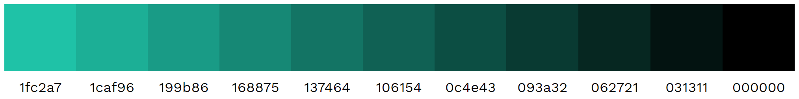
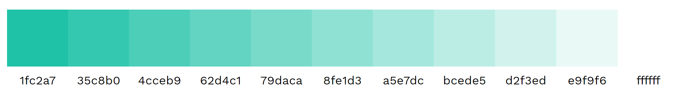
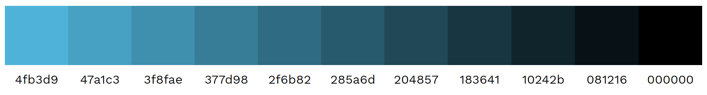
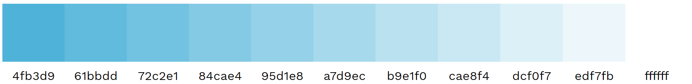
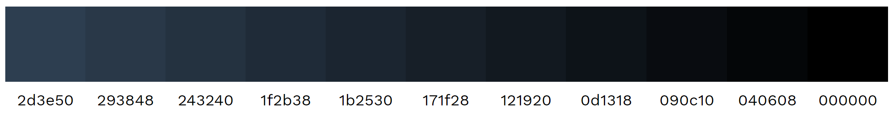
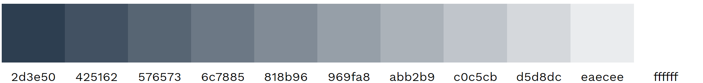
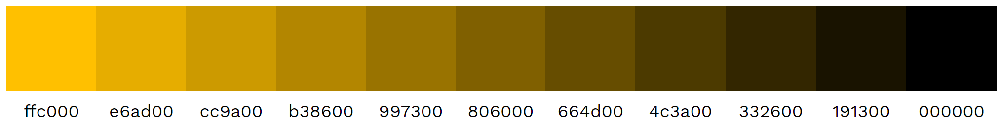
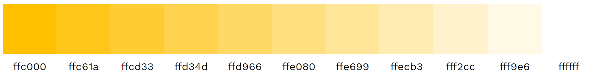
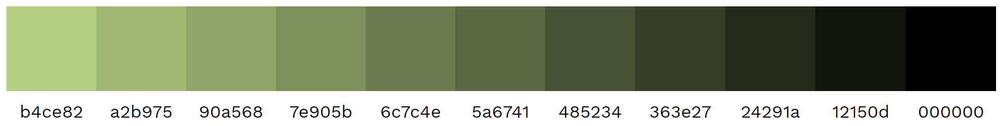

# Branding
Information about DataPLANT branding (color schemes etc.)

### Light/Dark Base Colors:

| Preview | Name | Hex |
|---|---|---|---|---|
|  | white | #FEFEFE | 
|  | lightgray | #ECEBEB | 
|  | black | #3A3A3A | 

### Base Colors:

| Preview | Name | Hex |
|---|---|---|---|---|
|  | mint | #1FC2A7 | 
|  | lightblue | #4FB3D9 | 
|  | darkblue | #2D3E50 | 
|  | yellow | #FFC000 | 
|  | olive | #B4CE82| 

### Shading

#### mint:
- darker: 

    

    | base | 10% | 20% | 30% | 40% | 50% | 60% | 70% | 80% | 90% | black |
    |---|---|---|---|---|---|---|---|---|---|---|
    | #1fc2a7 | #1caf96 | #199b86 | #168875 | #137464 | #106154 | #0c4e43 | #093a32 | #062721 | #031311 | #000000 |
- lighter:

    

    | base | 10% | 20% | 30% | 40% | 50% | 60% | 70% | 80% | 90% | white |
    |---|---|---|---|---|---|---|---|---|---|---|
    | #1fc2a7| #35c8b0| #4cceb9| #62d4c1| #79daca| #8fe1d3| #a5e7dc| #bcede5| #d2f3ed| #e9f9f6| #ffffff
    
#### lightblue:
- darker: 

    

    | base | 10% | 20% | 30% | 40% | 50% | 60% | 70% | 80% | 90% | black |
    |---|---|---|---|---|---|---|---|---|---|---|
    | #4fb3d9| #47a1c3| #3f8fae| #377d98| #2f6b82| #285a6d| #204857| #183641| #10242b| #081216| #000000

- lighter:

    

    | base | 10% | 20% | 30% | 40% | 50% | 60% | 70% | 80% | 90% | white |
    |---|---|---|---|---|---|---|---|---|---|---|
    | #4fb3d9| #61bbdd| #72c2e1| #84cae4| #95d1e8| #a7d9ec| #b9e1f0| #cae8f4| #dcf0f7| #edf7fb| #ffffff

#### darkblue:
- darker: 

    

    | base | 10% | 20% | 30% | 40% | 50% | 60% | 70% | 80% | 90% | black |
    |---|---|---|---|---|---|---|---|---|---|---|
    | #2d3e50| #293848| #243240| #1f2b38| #1b2530| #171f28| #121920| #0d1318| #090c10| #040608| #000000

- lighter:

    

    | base | 10% | 20% | 30% | 40% | 50% | 60% | 70% | 80% | 90% | white |
    |---|---|---|---|---|---|---|---|---|---|---|
    | #2d3e50| #425162| #576573| #6c7885| #818b96| #969fa8| #abb2b9| #c0c5cb| #d5d8dc| #eaecee| #ffffff

#### yellow:
- darker: 

    

    | base | 10% | 20% | 30% | 40% | 50% | 60% | 70% | 80% | 90% | black |
    |---|---|---|---|---|---|---|---|---|---|---|
    | #ffc000| #e6ad00| #cc9a00| #b38600| #997300| #806000| #664d00| #4c3a00| #332600| #191300| #000000

- lighter:

    

    | base | 10% | 20% | 30% | 40% | 50% | 60% | 70% | 80% | 90% | white |
    |---|---|---|---|---|---|---|---|---|---|---|
    | #ffc000| #ffc61a| #ffcd33| #ffd34d| #ffd966| #ffe080| #ffe699| #ffecb3| #fff2cc| #fff9e6| #ffffff

#### olive:
- darker: 

    

    | base | 10% | 20% | 30% | 40% | 50% | 60% | 70% | 80% | 90% | black |
    |---|---|---|---|---|---|---|---|---|---|---|
    | #b4ce82| #a2b975| #90a568| #7e905b| #6c7c4e| #5a6741| #485234| #363e27| #24291a| #12150d| #000000

- lighter:

    

    | base | 10% | 20% | 30% | 40% | 50% | 60% | 70% | 80% | 90% | white |
    |---|---|---|---|---|---|---|---|---|---|---|
    | #b4ce82| #bcd38f| #c3d89b| #cbdda8| #d2e2b4| #dae7c1| #e1ebcd| #e9f0da| #f0f5e6| #f8faf3| #ffffff

